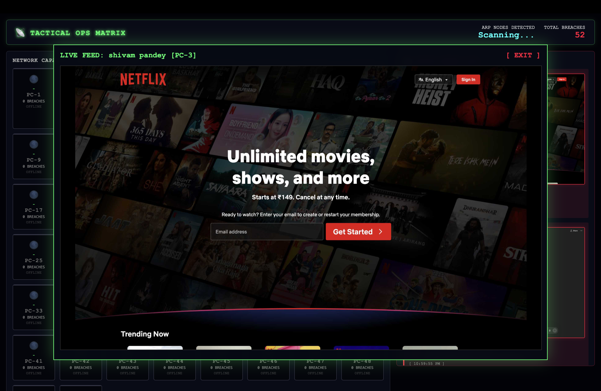
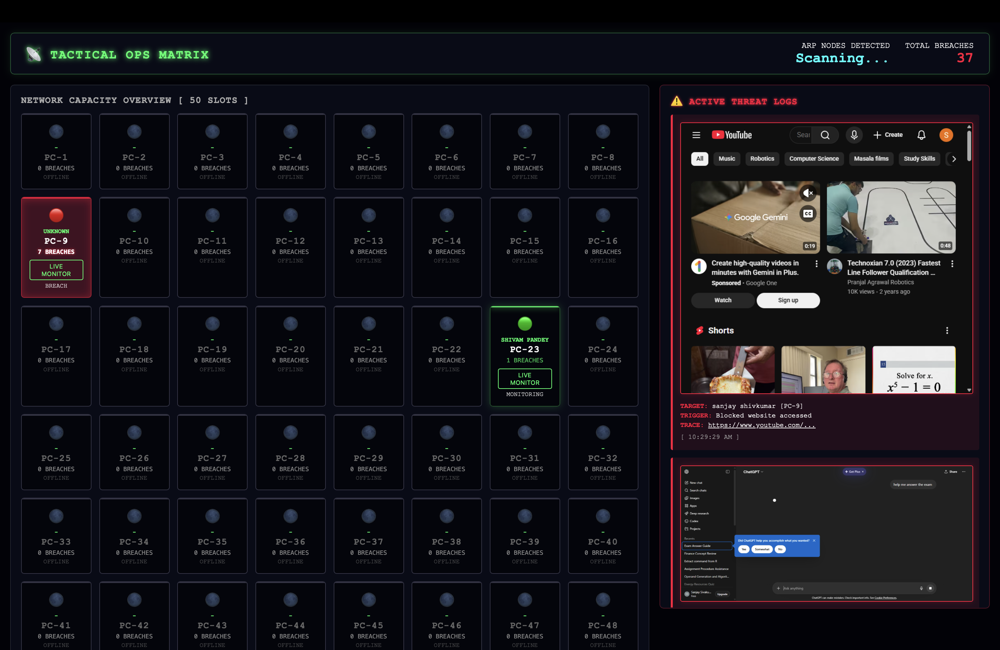

# 📡 SmartClass Monitoring System v2.0 (High-Novelty Edition)

A futuristic, real-time, anti-cheating classroom monitoring ecosystem featuring a 3D tactical HUD, live-stream supervision, and automated tampering detection.

---

## 🌌 Overview
Traditional proctoring is dull. **SmartClass** transforms classroom supervision into a 3D Command-and-Control experience. Using a combination of network heartbeat sensing and browser-level intelligence, it allows a single faculty member to monitor the activity of 50+ students simultaneously with zero lag.

---

## ⚡ Key Features

### 🖥️ 3D Tactical Matrix

- Visualizes up to 50 active PC nodes in a high-impact Three.js HUD.
- Real-time station mapping: 🟢 Connected, 🔴 Breach, ⚠️ Tampered.

### 🎥 Live Stream HUD

- Instant 3s screen-stream for targeted, aggressive supervision.

### 📊 Evidence Reporting

- Automated HTML audit dossier generated at session end.

- **🛡️ 3D Tactical Matrix Dashboard**: A high-impact Three.js HUD that visualizes up to 50 active PC nodes. Each card maps a student's state:
  - 🟢 **Connected**: Active & following rules.
  - 🔴 **Breach**: Accessing restricted sites (with instant camera-shake alerts).
  - ⚠️ **Tampered**: Connection lost (Extension disabled or Wi-Fi cutoff).
- **📸 Evidence Capture**: Automatically snaps screenshots of the student's screen upon detection of a blacklist URL or sensitive keyword.
- **🎥 Live Stream HUD**: Faculty can initiate a 3-second interval high-frequency stream for any student suspected of suspicious behavior.
- **📥 Automated Audit Export**: Generate and download a professional HTML/PDF evidence report at the end of every session.
- **🆔 Real-Time Identification**: Extensions automatically prompt students for their names, which sync instantly to the supervisor's 3D grid.

---

## 🛠️ Tech Stack

- **Backend**: Python (Flask), Flask-SocketIO, Flask-CORS.
- **Frontend**: Vanilla JS, **Three.js** (3D Visuals), Socket.IO.
- **Extension**: Chrome Manifest V3, `chrome.scripting`, `chrome.tabs.captureVisibleTab`.
- **Logic**: Heartbeat Polling, URL Keyword Filtering, Dynamic Content Scraping.

---

## 🚀 Setup & Installation

### 1. Server Configuration
```bash
cd /better/server
# Install dependencies
pip install flask flask-socketio flask-cors eventlet
# Start the Master Brain
python3 server.py
```
*The dashboard will be live at `http://localhost:5050`.*

### 2. Extension Installation
1. Open Google Chrome.
2. Navigate to `chrome://extensions`.
3. Enable **Developer Mode** (top-right).
4. Click **Load Unpacked**.
5. Select the `/better/extension` folder.

---

## 📡 Multi-PC Classroom Demo
To use this across multiple laptops on the same Wi-Fi:
1. **Find Serial**: Find your Mac's local IP (e.g., `192.168.1.5`).
2. **Update Config**: Edit `better/extension/config.js` and change `localhost` to your IP.
3. **Deploy**: Copy the extension folder to all student laptops—they will automatically connect to your 3D Master Dashboard.

---

## 🛡️ Conclusion
SmartClass isn't just a filter; it's a proactive deterrent. By providing educators with high-novelty visual tools and undeniable visual proof, it creates a transparent and fair examination environment for everyone.

---
*Created by the SmartClass Team - 2026*
